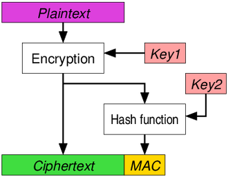

## AEAD
Authenticated Encryption with Associated Data (AEAD) 是一种同时具备保密性，完整性和可认证性的加密形式。认证加密是一种将对称密码和消息认证相结合的技术，同时满足加密性，完整性和认证性三大功能。

AEAD 产生的原因很简单，单纯的对称加密算法，其解密步骤是无法确认密钥是否正确的。也就是说，加密后的数据可以用任何密钥执行解密运算，得到一组疑似原始数据，而不知道密钥是否是正确的，也不知道解密出来的原始数据是否正确。

因此，需要在单纯的加密算法之上，加上一层验证手段，来确认解密步骤是否正确。

认证加密有几种，这里举例：例如 Encrypt-then-MAC，先用对称密码将明文加密，然后计算密文的 MAC 值。Encrypt-and-MAC，将明文用对称密码加密，并对明文计算 MAC 值。MAC-then-Encrypt，先计算明文的 MAC 值，然后将明文和 MAC 值同时用对称密码加密。在 HTTPS 中，一般使用 MAC-then-Encrypt 这种模式进行处理。

简单地把加密算法和认证算法组合，可以实现上述目的，并由此产生了几个方案：

第一种方案，EtM (Encryption then MAC)

先加密，然后对密文进行 MAC 运算（一般用各种 HMAC），把二者拼接起来，发给接收方。

接收方先验证 MAC，如果验证通过，则证明密钥是正确的，然后执行解密运算。

第二种方案，E&M (Encryption and MAC)

同时对原始数据执行加密和 MAC 运算，把二者拼接起来，发给接收方。

接收方先进行解密，然后对解密结果执行 MAC 运算，比对发来的 MAC，验证正确性。

第三种方案，MtE (MAC then Encryption)

与 EtM 相反，先对原始数据执行 MAC 运算，与原始数据拼接后，执行加密算法，将密文发送给接收方。

接受方先进行解密，然后执行 MAC 运算，验证解密结果是否正确。

然而，业内逐渐意识到以上通过组合加密和认证算法来实现 AEAD 的方案都是有安全问题的。

具体安全问题细节略去不表。

从 2008 年起，业内开始提出，需要在一个算法在内部同时实现加密和认证

基于这个思想，一些新的算法被提出，这些算法被称为真正的 AEAD 算法。

常见的 AEAD 算法如下：

AES-128-GCM
AES-192-GCM
AES-256-GCM
ChaCha20-IETF-Poly1305
XChaCha20-IETF-Poly1305
在具备 AES 加速的 CPU（桌面，服务器）上，建议使用 AES-XXX-GCM 系列，移动设备建议使用 ChaCha20-IETF-Poly1305 系列。

在设计加密系统的时候，请务必选用 AEAD 算法，抛弃旧的 MtE，EtM，E&M 方案。
